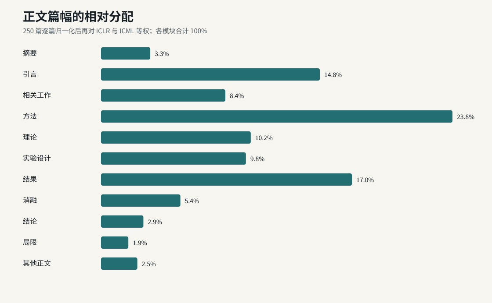
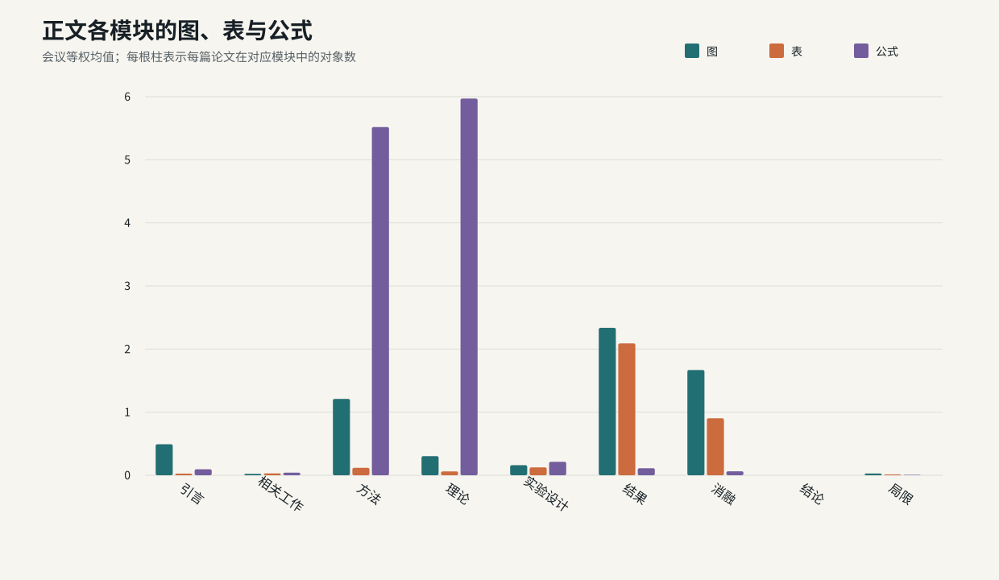
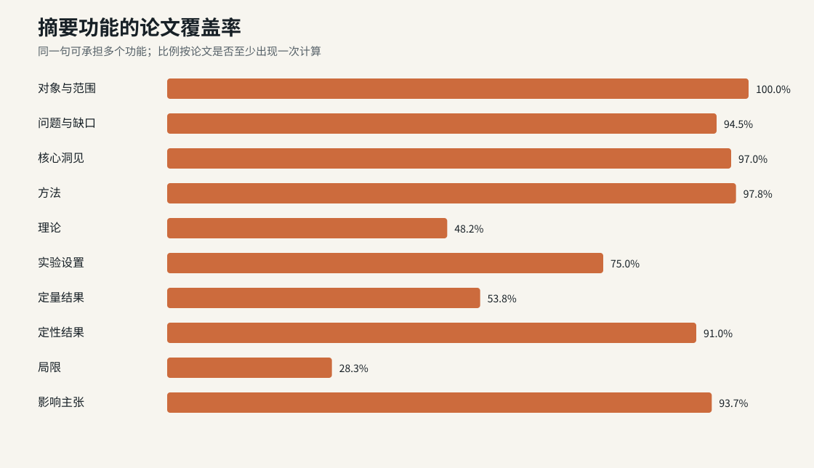
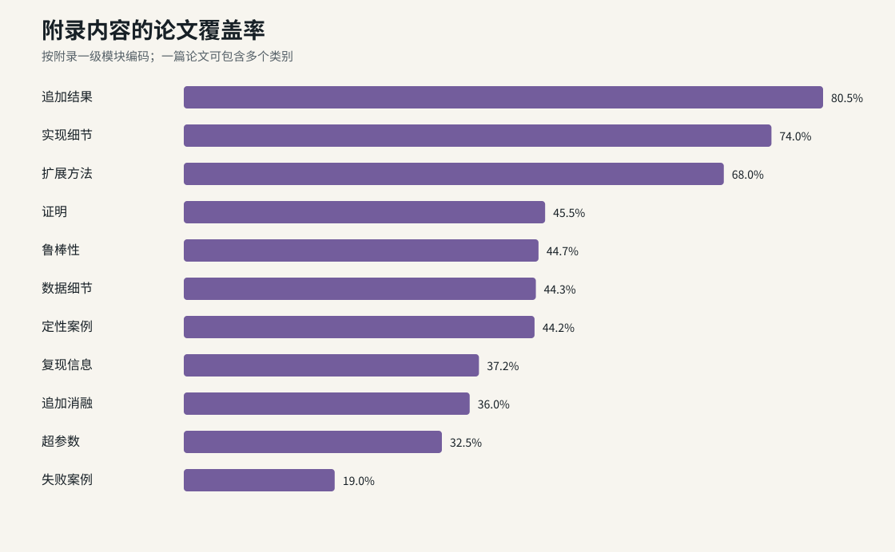

# 2026 ICLR/ICML 顶级论文写作解剖：250 篇统计报告

本报告以 250 篇已完成统一深读的论文为统计总体：ICLR 150 篇，包括 2 篇 Outstanding 和 148 篇 Oral；ICML 100 篇，包括 2 篇 Outstanding、49 篇 Oral 和 49 篇 Spotlight。每篇论文均完整阅读正文、参考文献和附录，并按同一 schema 编码 12 个模块、摘要句功能、段落动作、实验设计、结果、消融、图表、公式、理论对象、主张闭环、限制和附录职责。样本组成见 [`checkpoint_250_status.json`](checkpoint_250_status.json)，逐篇证据位于 [`readings/`](../readings/)。

篇幅比较先在论文内归一化，再分别计算 ICLR 和 ICML 的会议内结果，报告中的「会议等权」为两会均值的平均。比例型结论采用论文覆盖率与逐篇篇幅比例；长尾计数同时报告中位数、四分位数和均值。完整数据位于 [`reports/tables/`](tables/)。

快速入口：[写作手册](../docs/writing-playbook.md) · [逐篇深读索引](reading_index.md) · [统一深读协议](../prompts/deep-read.md) · [统计分析方案](../docs/statistical-analysis-plan.md)



## 一、最高频普适模式

1. **正文重心为方法、结果和引言。** 三者会议等权占比分别为 23.83%、17.01% 和 14.84%，合计 55.68%。加入理论、实验设计和相关工作后，六个核心模块合计 84.09%。
2. **摘要按功能链推进。** 100% 交代对象，94.5% 交代问题或缺口，97.0% 给出核心洞见，97.8% 说明方法，91.0% 给出定性结果，93.7% 回收到影响主张。完整句序共有 242 种，普适性来自功能顺序，而非固定句数。
3. **结果和消融承担最高图表密度。** 结果模块平均每篇 2.34 幅图、2.09 张表；消融平均 1.67 幅图、0.90 张表。理论和方法承担公式：理论为 5.97 个展示公式/篇，方法为 5.52 个/篇。
4. **实验结果以描述性聚合为主。** 80.4% 的结果统计方法字段出现 mean、average、median 或 aggregate；72.4% 明确呈现点估计而没有不确定性；42.8% 报告 seed、run 或重复试验，23.2% 报告 SD/SE，9.6% 使用区间或误差带，5.2% 使用假设检验或 p 值。
5. **正文给决策接口，附录给核查材料。** 附录页数中位数为正文的 1.40 倍，附录词数中位数为正文的 0.84 倍。81.6% 放追加结果，74.4% 放实现细节，68.0% 放扩展方法，44.4% 放证明。附录一级模块有 86.2% 被正文显式调用。
6. **故事主线通常闭合到结果，机制闭环更稀缺。** 94.8% 形成「对象→缺口」，94.0% 形成「缺口→核心洞见」，98.4% 形成「实验→结果」，84.4% 形成「结果→消融」。同时具备对象、缺口、核心洞见、组件、公式、预测、实验、结果、消融和结论的论文为 30.8%。
7. **不利信息采用“主文摘要、附录展开”的版面结构。** 87.2% 在主文出现限制证据，80.0% 又在附录展开；86.4% 的不利信息处理涉及附录，36.8% 存在位置延后，36.0% 使用语气弱化，31.6% 以代表案例呈现。

## 二、正文篇幅、图、表、算法和公式

下表中的正文占比为逐篇归一化后的会议等权均值；中位数和四分位数来自 250 篇论文等权分布。对象数同样为会议等权的每篇均值。数据源：[`checkpoint_250_module_summary.csv`](tables/checkpoint_250_module_summary.csv)。

| 模块 | 正文占比 | 中位数 [Q1, Q3] | 论文覆盖率 | 图/篇 | 表/篇 | 算法/篇 | 展示公式/篇 |
|---|---:|---:|---:|---:|---:|---:|---:|
| 摘要 | 3.34% | 3.25% [2.81%, 3.98%] | 100.0% | 0.105 | 0 | 0 | 0 |
| 引言 | 14.84% | 14.33% [12.26%, 17.48%] | 100.0% | 0.492 | 0.027 | 0.010 | 0.095 |
| 相关工作 | 8.43% | 8.42% [6.15%, 10.99%] | 99.2% | 0.023 | 0.030 | 0 | 0.042 |
| 方法 | 23.83% | 23.18% [17.91%, 28.62%] | 100.0% | 1.210 | 0.118 | 0.388 | 5.518 |
| 理论 | 10.15% | 7.96% [0%, 15.83%] | 67.8% | 0.303 | 0.062 | 0.020 | 5.970 |
| 实验设计 | 9.83% | 9.30% [6.53%, 12.17%] | 98.2% | 0.160 | 0.125 | 0.007 | 0.213 |
| 结果 | 17.01% | 15.84% [11.89%, 21.98%] | 98.5% | 2.337 | 2.090 | 0 | 0.112 |
| 消融 | 5.38% | 4.86% [0%, 9.00%] | 83.2% | 1.668 | 0.903 | 0 | 0.063 |
| 结论 | 2.87% | 2.59% [1.96%, 3.38%] | 96.5% | 0 | 0 | 0 | 0 |
| Limitations | 1.85% | 1.04% [0%, 2.76%] | 75.8% | 0.028 | 0.013 | 0 | 0.007 |
| 其他正文 | 2.46% | 0% [0%, 2.76%] | 97.3% | 0.032 | 0.007 | 0 | 0.252 |

正文语义模块共编码 1,542 幅图、845 张表、101 个算法对象和 2,855 个展示公式，折合每篇 6.17 幅图、3.38 张表、0.40 个算法和 11.42 个公式。中位论文有 5 幅正文图、3 张正文表和 8 个正文公式；四分位区间分别为 4–7、1.25–5 和 4–14.75。附录另有 1,694 幅图、1,501 张表、145 个算法和 4,578 个公式。

ICML 的正文公式均值为 16.53，ICLR 为 8.01；ICML 的正文图均值为 7.31，ICLR 为 5.41。两会的模块排序一致：方法居首，结果第二，引言第三。会议等权与论文等权的排序也一致。



### 正文的视觉分工

- **引言图**：问题示意、任务定义、能力缺口或 headline 结果；44.4% 的论文在引言放图。
- **方法图**：输入、组件、状态、数据流和输出；84.8% 的论文有方法视觉对象。
- **结果图**：趋势、Pareto、伸缩、失败面或总体比较；97.6% 的论文有结果视觉对象。
- **结果表**：精确数值、跨任务比较、基线排名和成本；表格与图的数量在结果模块接近等量。
- **消融图表**：组件删除、规模/超参、任务异质性、替代解释和失败切片；其每千词视觉密度为 5.74，高于结果模块的 4.42。
- **理论公式**：目标、变换、条件、保证和证明接口；公式密度为 7.50/千词。
- **方法公式**：定义组件、目标函数、更新规则和预测接口；公式密度为 3.76/千词。

## 三、摘要的结构

摘要平均 188 词、7.97 句；中位数为 181 词、8 句，句数四分位区间为 7–9。功能覆盖和首次出现位置来自 [`checkpoint_250_abstract_summary.csv`](tables/checkpoint_250_abstract_summary.csv)。

| 功能 | 论文覆盖率 | 首次出现的归一化中位位置 |
|---|---:|---:|
| 对象与范围 | 100.0% | 0.00 |
| 问题与缺口 | 94.8% | 0.11 |
| 核心洞见 | 97.2% | 0.33 |
| 方法 | 98.0% | 0.33 |
| 理论 | 47.2% | 0.50 |
| 定性结果主张 | 91.6% | 0.71 |
| 实验设置 | 76.0% | 0.80 |
| 定量结果 | 55.6% | 0.80 |
| 影响主张 | 94.4% | 0.83 |
| 局限 | 29.6% | 0.37 |



结果类型组合为：定量加定性 49.2%，仅定性 42.4%，仅定量 6.4%，两者均无 2.0%。因此 98.0% 的摘要至少写出一种结果。ICLR 的定量结果覆盖率为 62.7%，ICML 为 45.0%；ICML 的理论覆盖率为 53.0%，ICLR 为 43.3%。

摘要的高频功能链为：

```text
object/scope → problem/gap → core idea → method
→ setup or theory → qualitative result → quantitative result → impact
```

最常见的相邻转移是 `problem_gap → core_idea`（83.2%）、`object_scope → problem_gap`（76.4%）、`core_idea → method`（74.0%）、`method → qualitative_result`（64.4%）和 `qualitative_result → impact_claim`（55.6%）。完整句序高度分散，首位完整序列占 2.0%。写作时固定功能顺序，句数由内容压缩决定。

摘要中的实验结果写法分为六类：

1. 相对基线的准确率、成功率、质量或回报提升；
2. 速度、吞吐、内存、token、query 或训练成本变化；
3. 规模、数据量、任务数、模型数或环境数；
4. 理论复杂度、上界、下界、收敛或可识别性；
5. 跨任务、跨模型、跨分布的一致方向；
6. 失败率、攻击成功率、覆盖率或鲁棒性边界。

强摘要写法是「比较对象 + 决策量 + 一个数字 + 任务范围」。例如 [`CyberGym`](../readings/iclr-2026-023366ecf605.md) 在 PDF p.1 连续给出 1,507 个漏洞、约 20% 成功率、34 个 zero-days 和 18 个 incomplete patches；[`ThinKV`](../readings/iclr-2026-0b114f73a492.md) 在 p.1 交代 KV cache 低于原始值 5%。理论摘要则把数字替换为保证、复杂度或完备性；[`Transformers are Inherently Succinct`](../readings/iclr-2026-88c6c50ec3eb.md) 在 p.1 以 EXPSPACE-complete 回收理论结果。

## 四、相关工作如何写

Related Work 平均 550 词，中位数 507 词，正文占比中位数 8.42%，四分位区间为 6.15%–10.99%。43.6% 的论文在 PDF p.1–2 首次进入相关工作，25.6% 在 p.3–5，23.2% 在 p.6 以后，7.6% 把首次系统讨论放到正文之后。

严格 canonical 动作的论文覆盖率为：最近邻对比 44.8%，taxonomy 44.0%，gap creation 27.2%，credit/foundation 24.4%，prior limitation 24.4%，positioning-only 6.4%，chronology 4.8%。复合标签拆分后，taxonomy、最近邻对比和 gap creation 分别覆盖约 95.6%、96.0% 和 79.2%。动作与转移见 [`checkpoint_250_move_summary.csv`](tables/checkpoint_250_move_summary.csv) 和 [`checkpoint_250_transition_summary.csv`](tables/checkpoint_250_transition_summary.csv)。

高频组织方式为：

```text
按问题、假设、数据访问或计算约束建立分类轴
→ 选出最近邻工作
→ 写清 objective / assumption / scope / oracle / cost 的差异
→ 指出已有方法留下的缺口
→ 把缺口交给下一节的一个方法组件
```

正文相关工作写 400–700 词时，优先保留分类轴、最近邻差异、继承关系和方法缺口。附录可扩展完整 taxonomy、历史脉络和更远邻工作。按年份罗列、重复方法章节、以「仍有挑战」收尾都削弱了相关工作的决策作用。

[`CyberGym`](../readings/iclr-2026-023366ecf605.md) 在 p.3 先按漏洞任务分类，再用 Table 1 对比最近邻 benchmark，随后建立 historical-only gap，并明确继承 SWE-bench；[`p-less Sampling`](../readings/iclr-2026-ff40de6c7ac1.md) 在 pp.2–3 用 taxonomy、已有方法限制和最近邻差异把采样问题导向自己的方法。

## 五、方法、理论与段落推进

### 引言动作

严格 canonical 标签中，高频动作是 context 67.2%、contribution list 59.6%、prior failure 51.2%、problem 49.2%、core idea 44.8%、missing insight 42.0%、result preview 39.6%、method preview 38.4%。高频局部链为：

```text
context → problem → failure_of_prior_work
→ missing_insight → core_idea → method_preview
→ result_preview → contribution_list
```

贡献列表承担索引作用。每条贡献应指向一个对象、一个方法组件和一个决定性结果；删去只复述摘要的句子。

### 方法动作

| 动作 | 论文覆盖率 |
|---|---:|
| `define_component` | 72.8% |
| `setup_notation` | 70.0% |
| `state_problem` | 68.8% |
| `instantiate_algorithm` | 66.4% |
| `derive` | 65.6% |
| `explain_mechanism` | 51.6% |
| `connect_to_prediction` | 45.6% |
| `connect_to_experiment` | 43.2% |
| `contrast_alternative` | 36.0% |
| `state_complexity` | 22.0% |
| `summarize` | 18.4% |
| `give_intuition` | 16.8% |

最常见的转移是 `state_problem → define_component`（38.0%）、`setup_notation → state_problem`（34.8%）、`define_component → derive`（28.0%）、`define_component → explain_mechanism`（27.6%）、`state_problem → derive`（27.6%）和 `define_component → instantiate_algorithm`（22.8%）。

每个方法组件采用统一的五步推进：

```text
定义组件 → 给出对象和公式 → 解释机制
→ 写出可观测预测 → 指向对应实验
```

方法图、公式、算法分别承担接口、变换和执行顺序。样本中方法图加公式共现于 57.6% 的论文，算法加公式共现于 24.0%，方法图、算法和公式三者同时出现于 14.4%。同一机制应连续出现在图、公式、算法、结果和消融中，名称与符号保持一致。

### 理论

85.2% 有编号公式，35.6% 有 theorem，39.2% 有 proof，24.4% 有 lemma，22.4% 有 proposition。理论对象的角色以 core chain（89.6%）和 explanation（72.4%）为主；guarantee 为 45.6%，diagnostic 为 50.0%。正文写定理陈述、假设、结论、预测和实验对应，附录写证明链、技术条件和完整推导。

[`Lookahead Sample Reward Guidance`](../readings/icml-2026-2801956159d6.md) 形成 Figure 1（p.2）→ Algorithms 1–2（p.4）→ Eq. 11–19（pp.4–6）→ Table 2/Figure 4（pp.6–7）→ ablation（pp.8–9）的完整链；[`CyberGym`](../readings/iclr-2026-023366ecf605.md) 没有公式或定理，仍通过任务输入、执行判据、能力结果和安全影响形成经验闭环。

## 六、实验设计写到多深

实验设计 inventory 共 3,328 条，平均 13.31 条/篇。将同义记录归并为 15 个字段后，单篇中位覆盖 8 个字段，四分位区间为 6–9。汇总表见 [`checkpoint_250_experimental_design_summary.csv`](tables/checkpoint_250_experimental_design_summary.csv)。

| 实验设计字段 | 论文覆盖率 |
|---|---:|
| 指标与评价量 | 81.6% |
| 数据集与数据来源 | 79.2% |
| 基线与比较器 | 74.0% |
| 模型、架构或骨干 | 70.8% |
| 训练、计算或推理预算 | 70.4% |
| 任务、环境或协议 | 66.8% |
| 控制、匹配或干预 | 63.6% |
| 实现来源与复现材料 | 54.8% |
| 超参数和优化协议 | 50.4% |
| 硬件、软件或运行时 | 44.8% |
| Seed 或重复运行 | 37.6% |
| RQ、假设或预测 | 36.8% |
| 泄漏、污染或划分控制 | 21.2% |
| 失败、停止或接受标准 | 19.2% |
| 人类评测与标注 | 12.8% |

最高频的展示方式是「正文一段实验设置 + 一张主结果表 + 附录完整配置」。更强的形式是一张实验协议表，逐列写清数据、任务、模型、基线、指标方向、样本分母、seed/run、预算、硬件、划分、泄漏控制、停止规则和代码版本。

实验顺序应直接对应贡献和预测：主结果回答能力或效益；组件干预回答机制；鲁棒性回答分布变化；失败面板回答适用边界；成本表回答部署代价。正文保留决定结论的配置与分母，附录展开搜索空间、完整超参数、逐任务值和运行环境。

## 七、实验结果的统计方法

结果 inventory 共 2,518 条，平均 10.07 条/篇。归一化统计实践见 [`checkpoint_250_categorical_summary.csv`](tables/checkpoint_250_categorical_summary.csv)。

| 统计实践 | 论文覆盖率 |
|---|---:|
| `mean`、`average`、`median` 或 `aggregate` | 80.4% |
| 点估计且未给不确定性 | 72.4% |
| 重复运行、seed 或 trials | 42.8% |
| SD、SE 或方差 | 23.2% |
| 区间、误差条或不确定性带 | 9.6% |
| 相关分析 | 7.6% |
| 假设检验或 p 值 | 5.2% |
| Bootstrap | 4.4% |
| 回归或拟合模型 | 4.0% |
| Bayesian/posterior | 3.6% |
| 多重比较控制 | 1.6% |
| Effect size | 0.4% |

结果分析主要采用任务级、数据集级和模型级的描述性聚合，复杂推断较少。最常见路径为：样本或问题 → 任务/数据集 → 模型/方法 → seed/run。人类实验再加入 pair、annotator、majority vote 或一致性层级。

高质量写法应明确：

1. 聚合单位、各层分母和权重；
2. 最优值、均值、平均排名、win rate、failure count 或资源成本中的主决策量；
3. `±`、阴影和 error bar 的精确定义；
4. seed、任务、数据集和参与者的层级；
5. 检验类型、配对单位、效应量和多重比较处理；
6. Bootstrap 的重采样层级和次数；
7. 机制证据、实质差异和统计显著性的分别解释。

[`iclr-2026-2a0b369c60a9`](../readings/iclr-2026-2a0b369c60a9.md) 在 pp.7–9 报告 10-seed mean±SD，并在 pp.29–30 给 stratified bootstrap intervals；[`icml-2026-67206cc61e49`](../readings/icml-2026-67206cc61e49.md) 使用 25 个 independent random splits，并在 pp.7–8、49 画 standard-error regions；[`iclr-2026-b001d2f886cf`](../readings/iclr-2026-b001d2f886cf.md) 在 pp.33–35 报告 300 个 question pairs × 5 annotators、Cohen’s kappa、paired t-test 和 Cohen’s d。

## 八、伪代码写什么

剔除「无伪代码」占位项后，124/250，即 49.6% 的论文包含有效算法对象。68/250，即 27.2% 在正文放算法；56/250，即 22.4% 只在附录放算法。正文有 104 个有效算法对象，附录有 138 个。

伪代码的高频内容为输入、初始化、外层训练/推理循环、采样或 replay、梯度/损失/状态更新、条件分支、fallback、阈值、队列、终止条件和输出。可执行模板为：

```text
Input → Initialization → Loop → Branch / Update → Stop → Output
```

伪代码中保留执行顺序、状态、更新、分支、终止和复杂度；实验协议表承载 seed、数据划分、预算、硬件、版本、聚合层级和不确定性。公式变量、图中节点和算法变量使用同一命名。

## 九、模块如何形成闭环

250 篇共编码 1,972 条主张：29.0% 为 closed，61.1% 为 partially closed，4.7% 为 open，5.2% 为 not testable here。91.6% 的论文至少有一条 closed claim，33.6% 至少有一条 open claim。详见 [`claim_closure.csv`](tables/claim_closure.csv)。

高频闭环边为：

| 闭环边 | 论文覆盖率 |
|---|---:|
| 对象 → 缺口 | 94.8% |
| 缺口 → 核心洞见 | 94.0% |
| 核心洞见 → 方法组件 | 70.8% |
| 组件 → 公式/理论对象 | 68.8% |
| 公式 → 可观测预测 | 42.8% |
| 预测 → 实验 | 44.4% |
| 实验 → 结果 | 98.4% |
| 结果 → 消融 | 84.4% |
| 消融 → 结论 | 81.6% |

顶级论文最常见的故事是：先让读者接受问题与缺口，再把核心洞见拆成组件，把组件转成对象或公式，把结果按贡献编号回收。较弱的链条停在「方法有效」；较强的链条继续回答「为什么有效、何时失效、代价是什么」。

写作时建立一张 claim closure 表，每行包括：

```text
claim → method object → equation or guarantee → prediction
→ experiment → result → ablation → conclusion → appendix evidence
```

每个主张都需要一个正文决策对象。附录负责扩展证据，不替代正文的核心结论。

## 十、边界表达与不利信息的包装

Limitations 独立模块出现在 75.6% 的论文中，平均 159 词，中位数 115 词。位置可重叠：87.2% 在主文其他位置出现限制，61.2% 在结论或专门限制部分出现，80.0% 在附录展开，5.2% 在引言出现，2.8% 在摘要明确标注限制。类型归并见 [`checkpoint_250_limitation_type_summary.csv`](tables/checkpoint_250_limitation_type_summary.csv)。

| 限制类型 | 论文覆盖率 |
|---|---:|
| Scope | 88.4% |
| Data | 70.8% |
| Metric | 72.0% |
| Assumption | 62.8% |
| Compute | 62.0% |
| Deployment | 56.4% |
| Generality | 50.8% |
| Baseline | 40.8% |
| Ethics | 40.4% |
| Causality | 38.0% |

不利信息处理策略见 [`checkpoint_250_packaging_strategy_summary.csv`](tables/checkpoint_250_packaging_strategy_summary.csv)：

| 策略 | 论文覆盖率 | 版面效果 |
|---|---:|---|
| 附录迁移 | 86.4% | 主文保留 headline，附录展开失败、条件和分布 |
| 位置延后 | 36.8% | 先建立主要结果，再讨论边界 |
| 语气弱化 | 36.0% | 用 around、likely、on par、most、comparable 等控制强度 |
| 代表性案例 | 31.6% | 用可读案例说明现象，完整分布后移 |
| 聚合压缩异质性 | 22.8% | 主文先给平均、总体排名或 aggregate |
| 未来工作化 | 19.6% | 把未解决条件转成下一步路线 |
| 分母选择 | 14.8% | 用筛选后、成功后或特定子集作为结果分母 |
| 主动正面讨论 | 12.0% | 在结果附近直接展示成本、失败或理论缺口 |
| 指标替代 | 10.4% | 用 proxy、surrogate 或替代任务代表目标对象 |

这类包装最常发生在分母、聚合、案例选择、指标和位置五个节点。写作上应在正文保留会改变判断的数值：筛选规则、分母、关键失败率、任务异质性、主要成本和机制反例。附录放完整网格、案例全集和额外切片。

[`iclr-2026-ff40de6c7ac1`](../readings/iclr-2026-ff40de6c7ac1.md) 在 pp.9–10 使用筛选后的均值，p.23 说明部分模型为单 seed，p.33 展示精选案例；[`iclr-2026-a60437a1dcad`](../readings/iclr-2026-a60437a1dcad.md) 在 pp.8–9 先用 around 1–2% 描述差异，p.26 再展开主体异质性；[`icml-2026-73ef6e227632`](../readings/icml-2026-73ef6e227632.md) 在 pp.6–9 主动写出 backend failure、人工筛选和 incompleteness，并在 pp.24、34 展开完整结果分解。

## 十一、附录放什么、放多少

正文平均 10.02 页，附录平均 16.65 页；附录/正文页数比中位数 1.40，四分位区间 0.89–2.20。正文平均 6,155 词，附录平均 6,153 词；附录/正文词数比中位数 0.84，四分位区间 0.54–1.31。论文平均从正文调用附录 10.48 次，中位数 10 次，四分位区间 7–13。数据源：[`checkpoint_250_paper_summary.csv`](tables/checkpoint_250_paper_summary.csv) 和 [`appendix_inventory.csv`](tables/appendix_inventory.csv)。



| 附录类别 | 论文覆盖率 | 平均一级模块数/篇 |
|---|---:|---:|
| Additional result | 81.6% | 1.77 |
| Implementation detail | 74.4% | 1.25 |
| Extended method | 68.0% | 1.20 |
| Dataset detail | 45.2% | 0.63 |
| Robustness | 45.2% | 0.68 |
| Qualitative example | 44.8% | 0.59 |
| Proof | 44.4% | 1.27 |
| Ablation | 37.2% | 0.54 |
| Reproducibility | 37.2% | 0.47 |
| Hyperparameter | 30.8% | 0.35 |
| Failure case | 20.0% | 0.22 |

证明对象有 92.0% 位于附录，theorem statement 中有 33.2% 位于附录。40.6% 的结果 inventory 和 58.0% 的消融 inventory 位于附录。正文与附录的高频分工因此十分清晰：

### 正文保留

- 问题、主张、范围与决策量；
- 核心对象、符号、目标函数、方法接口和关键算法；
- theorem 的假设、结论和与主线的关系；
- 数据、任务、基线、指标、分母和主要预算；
- 一张主结果图或表；
- 一个机制关键消融或反事实；
- 一个决定适用范围的失败或成本；
- 结论逐项回收贡献；
- 每个附录关键对象的精确指针。

### 正文不放

- 全部证明步骤和技术引理链；
- 大规模超参数网格；
- 逐任务、逐模型、逐 seed 的完整结果矩阵；
- 额外 qualitative gallery；
- 重复定义、背景教材式推导和远邻文献史；
- 所有实现命令、环境版本和长配置表；
- 不改变主结论的稳健性和敏感性扩展。

### 附录放

- 完整证明、推导、算法变体和复杂度细节；
- 数据来源、拆分、清洗、标注和分母；
- 训练与推理配置、硬件、版本、随机种子和预算；
- 全结果表、鲁棒性、追加消融、异质性和失败全集；
- 人类评测问卷、annotator 协议和一致性；
- 复现命令、伪代码扩展和 qualitative grids。

附录篇幅可采用正文词数的 0.54–1.31 倍作为核心区间，长证明或大规模结果网格可继续扩展。正文每次调用附录都写明对象和用途，例如「完整证明见 Appendix C，正文在此使用其 finite-sample guarantee」，而非单独写「详见附录」。

[`icml-2026-67206cc61e49`](../readings/icml-2026-67206cc61e49.md) 在正文 pp.6–7 保留定义、定理和 Algorithm 1，附录 pp.22–39 放证明、pp.40–45 放扩展方法、pp.46–53 放实现；[`iclr-2026-88c6c50ec3eb`](../readings/iclr-2026-88c6c50ec3eb.md) 在正文 pp.7–10 保留定理陈述并逐项调用 pp.14–21 的证明。

## 十二、高频用词与修辞

正文词频统计覆盖 1,311,044 个词元。原始表见 [`lexical_frequencies.csv`](tables/lexical_frequencies.csv)、[`ngram_frequencies.csv`](tables/ngram_frequencies.csv) 和 [`rhetorical_patterns.csv`](tables/rhetorical_patterns.csv)。模板页眉、版权信息和 arXiv 固定语不进入写作结论。

### 高频实词

| 词 | 次数 | 论文覆盖率 | 每万词 |
|---|---:|---:|---:|
| model | 6,290 | 98.4% | 47.98 |
| models | 4,727 | 95.2% | 36.06 |
| training | 3,904 | 90.4% | 29.78 |
| data | 3,658 | 94.0% | 27.90 |
| performance | 2,985 | 94.0% | 22.77 |
| figure | 2,814 | 98.0% | 21.46 |
| reasoning | 2,638 | 52.0% | 20.12 |
| across | 2,562 | 94.8% | 19.54 |
| learning | 2,472 | 86.8% | 18.86 |
| results | 2,407 | 100.0% | 18.36 |
| table | 1,907 | 90.0% | 14.55 |
| appendix | 1,812 | 83.6% | 13.82 |

高频二元短语为 `language models`（465 次）、`reinforcement learning`（342）、`training data`（313）、`shown figure`（283）、`see appendix`（253）、`provided appendix`（240）、`shown table`（229）、`prior work`（215）和 `future work`（176）。`large language models` 出现 233 次，覆盖 104 篇。

### 主张与转折语言

| 模式 | 次数 | 论文覆盖率 | 每万词 |
|---|---:|---:|---:|
| `we introduce` | 527 | 81.2% | 4.02 |
| `we propose` | 503 | 70.4% | 3.84 |
| `we show` | 331 | 52.0% | 2.53 |
| `we find/found` | 277 | 42.4% | 2.11 |
| `we observe` | 196 | 42.4% | 1.50 |
| `we demonstrate` | 139 | 37.6% | 1.06 |
| `however` | 1,158 | 96.8% | 8.83 |
| `in contrast` | 493 | 77.6% | 3.76 |
| `significantly` | 451 | 70.8% | 3.44 |
| `novel` | 357 | 52.4% | 2.72 |
| `state-of-the-art` | 365 | 56.8% | 2.78 |
| `limitation(s)` | 463 | 74.0% | 3.53 |

动词应匹配证据角色：`propose/introduce` 对应方法对象；`show/establish` 对应证明或直接证据；`find/observe` 对应经验发现；`demonstrate` 对应跨设置验证。`significantly` 应紧邻具体检验或改写为数值幅度。`however` 和 `in contrast` 用于推进差异，不用于制造没有对象的转折。

## 十三、面向未来论文的写作规范

### 正文比例

经验型论文可从以下核心区间起稿：

- 引言：12%–17%；
- 相关工作：6%–11%；
- 方法：18%–29%；
- 理论：按主张需要，常见区间 0%–16%；
- 实验设计：7%–12%；
- 结果：12%–22%；
- 消融：0%–9%，机制型工作优先保留 3%–9%；
- 结论：2%–3.5%；
- Limitations：0%–3%，正文仍需保留决定适用范围的一句话或一个数字。

理论型论文将结果空间转给 theorem、proof sketch、复杂度和可观测预测；系统型论文将理论空间转给架构、资源、延迟、故障和部署实验。所有类型都保留对象、缺口、方法接口、决定性证据和结论回收。

### 每段推进

每段承担一个主要动作：

```text
上一段留下的问题
→ 本段给出的对象或判断
→ 支撑它的公式、图、表或证据
→ 下一段需要回答的问题
```

方法段按组件组织，结果段按 prediction 或 claim 组织，消融段按替代解释组织。标题与贡献列表使用相同词汇，图表顺序跟随论证顺序。

### 图表和公式

- 引言保留一张问题/系统总览图；
- 方法保留一张接口图，并让公式和伪代码复用图中名称；
- 结果保留主比较图或表、机制图和失败/成本图；
- 消融优先画组件干预、任务异质性和替代解释；
- 表格承载精确数值，图承载结构、趋势和分布；
- 每个公式后写角色：定义、变换、保证、解释或诊断；
- 每个 theorem 后写假设、结论、预测和实验对应；
- 每个算法写输入、状态、更新、分支、停止、输出和复杂度。

### 实验与结果

- 先列 RQ、预测和失败规则；
- 设计表写清 15 个实验字段；
- 主结果、机制、鲁棒性、失败和成本各有独立证据对象；
- 报告各层分母、权重、重复单位和缺失处理；
- 误差条、阴影和 `±` 均给定义；
- 聚合表同时给任务级异质性入口；
- 代表案例附选择规则与总体分母；
- 使用 proxy 时写明目标对象和代理关系。

### 正文不写

- 与主张无关的背景综述；
- 重复摘要的贡献句；
- 没有比较维度的相关工作列表；
- 没有角色解释的公式堆叠；
- 与正文符号不一致的伪代码；
- 没有分母的百分比；
- 没有定义的误差条和 `±`；
- 以平均值覆盖关键反向任务的结果表；
- 以代表案例代替总体频率；
- 在结论首次提出新主张或新数字。

## 十四、建议的论文工作流

1. **建立 claim map。** 每个贡献写成可判定主张，并指定方法对象、预测、实验和结论位置。
2. **建立实验协议表。** 在跑实验前确定数据、任务、基线、指标、分母、seed、预算、硬件、划分、泄漏和停止规则。
3. **先画证据骨架。** 预先确定总览图、主结果图/表、机制消融和失败/成本面板。
4. **写方法对象。** 依次完成定义、公式、机制、预测和实验接口。
5. **写结果与消融。** 按 claim 顺序回答，保留任务异质性、失败和资源代价。
6. **组织附录。** 证明、配置、完整结果、鲁棒性、失败全集和复现材料分别成章，每章由正文精确调用。
7. **回写引言和相关工作。** 用已经闭合的证据确定 missing insight、最近邻差异和贡献列表。
8. **最后写摘要与结论。** 摘要压缩对象、缺口、核心、方法、结果和影响；结论按贡献顺序回收，不引入新证据。
9. **执行语言检查。** 核对 `show/find/observe/demonstrate` 的证据角色，删除无对象的 `novel`、`significantly` 和 SOTA 表述。
10. **执行闭环检查。** 对每条主张核对方法、预测、结果、消融、边界、结论和附录指针。

## 十五、复现入口

```bash
python3 scripts/aggregate.py
python3 scripts/cohort_analysis.py --bootstrap-replicates 5000
python3 scripts/lexical_analysis.py
python3 scripts/checkpoint_analysis.py --target 250
python3 scripts/checkpoint_design_taxonomy.py --target 250
python3 scripts/checkpoint_limitation_taxonomy.py --target 250
python3 scripts/render_checkpoint_figures.py --target 250
uv run --with jsonschema python3 scripts/validate.py
```

核心产物：

- [`checkpoint_250_module_summary.csv`](tables/checkpoint_250_module_summary.csv)：模块比例、presence、图表算法与公式；
- [`checkpoint_250_paper_summary.csv`](tables/checkpoint_250_paper_summary.csv)：正文、附录、摘要和闭环的论文级分布；
- [`checkpoint_250_abstract_summary.csv`](tables/checkpoint_250_abstract_summary.csv)：摘要功能和首次位置；
- [`checkpoint_250_move_summary.csv`](tables/checkpoint_250_move_summary.csv)：引言、相关工作和方法动作；
- [`checkpoint_250_transition_summary.csv`](tables/checkpoint_250_transition_summary.csv)：段落动作转移；
- [`checkpoint_250_categorical_summary.csv`](tables/checkpoint_250_categorical_summary.csv)：附录、理论、视觉、闭环和统计实践；
- [`experimental_design_inventory.csv`](tables/experimental_design_inventory.csv)：逐篇实验设计证据；
- [`result_inventory.csv`](tables/result_inventory.csv)：逐项结果、比较和统计方法；
- [`limitation_inventory.csv`](tables/limitation_inventory.csv)：逐项限制与页码；
- [`adverse_strategy_inventory.csv`](tables/adverse_strategy_inventory.csv)：逐项不利信息处理；
- [`appendix_inventory.csv`](tables/appendix_inventory.csv)：附录类别、跨度和正文调用；
- [`lexical_frequencies.csv`](tables/lexical_frequencies.csv) 与 [`ngram_frequencies.csv`](tables/ngram_frequencies.csv)：词频和短语频率。
