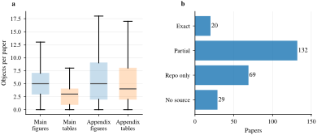
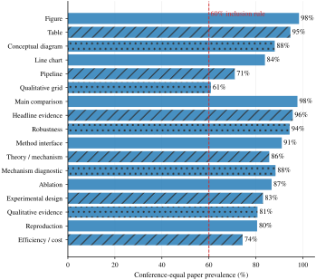
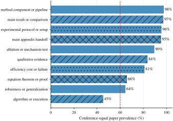
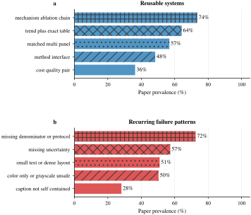

# 250 篇 ICLR/ICML 2026 顶级论文图表解剖

本报告逐篇核对 250 篇 Outstanding、Oral、Spotlight 论文的正文与附录，建立 3,071 个 Figure、2,329 个 Table、合计 5,400 个视觉对象的人工审计账本。每个对象均记录页码、模块、用途、图型、面板、字体、颜色、坐标、legend、marker、线型、网格、不确定性、caption、表头、数据统计、证据关系和公开视觉源码。逐篇证据见[视觉审计索引](visual_audit_index.md)，结构化对象见 [`visual_audit_object_inventory.csv`](tables/visual_audit_object_inventory.csv)。

统计先在论文内计算对象比例，再计算会议内均值，最后令 ICLR 与 ICML 等权。论文覆盖率回答“多少论文至少出现一次”；论文归一对象占比回答“该类对象在一篇典型论文的视觉预算中占多少”。两者分别用于决定是否纳入和决定投入多少版面。



## 一、每篇论文放多少图表

| 对象 | 会议等权均值 | 中位数 | Q1–Q3 | 范围 |
|---|---:|---:|---:|---:|
| 全部 Figure | 12.50 | 10.0 | 7.0–15.0 | 0–134 |
| 全部 Table | 9.16 | 8.0 | 5.0–12.0 | 0–75 |
| 正文 Figure | 5.12 | 5.0 | 3.0–7.0 | 0–14 |
| 正文 Table | 3.12 | 3.0 | 1.0–4.0 | 0–13 |
| 附录 Figure | 7.38 | 5.0 | 2.0–9.0 | 0–130 |
| 附录 Table | 6.04 | 4.0 | 2.0–8.0 | 0–68 |

按会议等权均值向上取整，一篇完整论文采用 **6 幅正文 Figure、4 张正文 Table、8 幅附录 Figure、7 张附录 Table**。正文 Figure 中 53.0% 位于正文，Table 中 58.1% 位于附录：图负责在正文完成论证，表负责在附录保留精确数值与覆盖面。

## 二、超过 60% 论文的视觉构件

下表的第一列是论文覆盖率，第二列是逐篇归一后的视觉预算占比。一个对象可同时承担多个用途。

| 构件/用途 | 论文覆盖率 | 论文归一对象占比 |
|---|---:|---:|
| Figure | 98.3% | 56.7% |
| Table | 94.7% | 42.0% |
| 概念/机制示意图 | 88.0% | 11.2% |
| 折线图 | 83.8% | 24.7% |
| 流程图 | 71.0% | 6.4% |
| 质性对照网格 | 60.8% | 11.8% |
| 主比较 | 97.7% | 41.4% |
| headline 证据 | 95.7% | 14.4% |
| 鲁棒性 | 94.3% | 35.6% |
| 方法接口 | 91.0% | 15.0% |
| 理论/机制 | 85.7% | 15.8% |
| 机制诊断 | 88.3% | 20.9% |
| 消融 | 86.7% | 19.3% |
| 实验设计 | 83.0% | 15.9% |
| 质性证据 | 80.7% | 20.7% |
| 复现信息 | 80.5% | 17.8% |
| 效率/成本 | 74.3% | 14.6% |



Figure 与 Table 共同构成正文主干：概念/机制图定义对象和信息流，流程图给出执行接口，折线图展示尺度、预算、时间或超参变化，表格给出精确比较值。主比较、headline、鲁棒性、方法接口、机制、消融、实验设计、复现与成本共同组成闭环；将多个用途绑定到同一视觉对象，可在 9 页内覆盖全部高频职责。

## 三、Figure 的制作范式

### 3.1 尺寸、面板和复杂度

- 对 ICLR checkpoint PDF 的第二页双栏版面测量得到 5.50 in 正文宽度和 2.63 in 对称单栏宽度；逐篇结果见 [`iclr_pdf_layout_measurements.csv`](tables/iclr_pdf_layout_measurements.csv)。
- Figure 的页宽对象占 59.7%，单栏对象占 23.3%。
- Figure 的 vector、raster、mixed 渲染分别占 37.2%、35.4%、27.4%；曲线、示意和表格优先保留矢量，真实图像只栅格化对应 panel。
- 正文 Figure 的面板中位数为 2，Q1–Q3 为 1–4；附录中位数为 2，Q1–Q3 为 1–4。
- 正文数据图系列数中位数为 4，Q1–Q3 为 2–5。正文用 2–4 个面板、4 个主要系列；附录再扩展 facet、数据集和失败切片。
- 正文图复杂度中位数为 4/5。方法总览保持 2–3，主结果/消融保持 3–4，密集 qualitative grid 与全量诊断放入附录。

### 3.2 字体、字重和线条

- Figure 内文字中位数为 8.0 pt；最小字号中位数 6.0 pt，最大字号中位数 10.0 pt。
- Times-like serif 是 Figure 的主要字体类别，占逐篇归一 Figure 对象的 57.1%；regular 与 bold 分别承担数据标签和层级标题。
- 数据线宽中位数为 1.0 pt，Q1–Q3 为 0.8–1.1 pt。
- 正文 Figure 的 marker 类型、线型和参考线数量中位数为 0/1/0；同一系列的颜色、marker 与线型在正文和附录保持绑定。
- 可直接采用：8 pt 常规字、8.5 pt panel/局部标题、7.5 pt tick/legend、6 pt 绝对下限、1 pt 数据线、0.6–0.8 pt 轴线、3.5 pt marker。

### 3.3 颜色和编码

Figure 中 categorical palette 占 46.3%，mixed palette 占 40.8%。颜色、marker、线型或直接文字构成冗余编码的 Figure 占 78.3%。

最高频 HEX 以 Matplotlib/Tableau 主色为核心：`#1F77B4`（70 篇）、`#2CA02C`（66 篇）、`#FF7F0E`（62 篇）、`#D9D9D9`（60 篇）、`#FF0000`（56 篇）、`#D62728`（55 篇）、`#F28E2B`（43 篇）、`#222222`（36 篇）、`#FDE725`（34 篇）、`#7F7F7F`（34 篇）。推荐序列固定为 `#1F77B4`、`#FF7F0E`、`#2CA02C`、`#D62728`、`#9467BD`；同一方法在所有图中保持同色，并同时绑定 marker 和线型。

### 3.4 坐标、legend、网格和不确定性

- 折线图中双轴网格占 67.7%，无网格占 21.2%；采用 0.45 pt、低 alpha 的浅灰网格。
- 折线图 x/y 轴使用 linear scale 的比例为 59.1%/86.6%，使用 log scale 为 11.3%/8.2%；log 轴在轴标签与 caption 同时声明。
- 折线图使用 legend 的对象占 83.9%；legend 项数中位数为 2。series 不超过 4 时直接标注末端，更多 series 使用共享 legend。
- 折线图共享 legend 占 22.7%；多面板图只保留一份共享 legend，并按视觉读取顺序排列。
- Figure 的直接标注占 61.5%。
- Figure 未显示不确定性的对象占 86.0%；band 与 error bar 分别占 6.4% 和 3.9%。新论文的主结果、消融和敏感性图统一写清 seed/run、聚合单位与 band/error bar 的统计量。

## 四、Table 的制作范式

- 正文 Table 的行数中位数为 6，列数中位数 6，表头层级中位数 1，小数精度中位数 2 位。
- `booktabs` 占逐篇归一 Table 的 66.4%；partial grid 占 25.5%。正文默认 `booktabs`，只用横线分隔表头与 row group。
- bold 出现在 56.5% 的 Table；best/second-best 组合占 14.2%。最佳值用 bold，次佳值用 underline；指标方向在表头用 ↑/↓。
- 正文表体 8 pt、表头 8–8.5 pt，第一列左对齐，数值列按小数点对齐；正文保持 6–8 列、6–10 个主要行，完整 benchmark×model 矩阵移入附录。
- Table 的 point-only/undefined uncertainty 占 40.2%。主结果表直接显示 `mean ± SD/SE`，caption 定义重复次数、聚合层级和 failure/OOM 记号。

## 五、caption 与表头

正文 Figure caption 的对象中位数为 37 词，逐篇会议等权均值为 47.1 词；正文 Table 分别为 25 与 32.4 词。附录 Figure/Table caption 中位数为 21/16 词。

caption 动作按以下顺序组织：

```text
粗体功能标题 → 实验设置/对象 → panel 与颜色/线型编码
→ 比较对象和方向 → 一个决定性发现 → uncertainty/分母 → appendix 指针
```

`title`、`setup`、`comparison`、`encoding_key`、`main_finding` 的论文覆盖率分别为 98.7%、98.2%、95.8%、95.7%、83.7%。正文 Figure 目标长度取 48 词，正文 Table 取 33 词；caption 能独立回答“画了什么、怎样比较、编码是什么、读出什么”。

Figure caption 中，粗体功能标题占 28.2%，自包含 caption 占 55.3%，直接写出主发现占 40.0%。Table caption 的三项比例分别为 23.0%、60.2% 和 18.4%。推荐配置统一使用粗体功能标题和自包含设置；主发现只写一个决定性读数。

Figure caption 的高频功能短语为 `overview of`（66 篇）、`comparison of`（65 篇）、`illustration of`（64 篇）和 `as a function of`（25 篇）。Table caption 高频使用 `comparison of`（86 篇）、`the best`（68 篇）、`ablation study`（38 篇）、`we report`（60 篇）和 `higher is better`（12 篇）。这些短语承担对象命名、比较、干预和指标方向，具体名词与数字必须紧随其后。

## 六、图表与论证闭环

逐篇审计的高价值模式中，机制—消融证据链覆盖 73.5%，趋势图与精确数值表配对覆盖 64.2%，同构多面板对照覆盖 56.8%。

对象级 `evidence_relation` 显示，Figure/Table 与方法组件或流程形成显式连接的论文覆盖率为 97.7%，与主结果或比较连接为 97.3%，与消融或机制检验连接为 89.5%，与公式、定理或证明连接为 65.8%，形成正文—附录交接为 95.3%。完整对象级比例见 [`visual_evidence_relation_summary.csv`](tables/visual_evidence_relation_summary.csv)。



稳定闭环为：

```text
Figure 1 定义对象、组件与信息流
→ 公式/算法给出变换
→ 实验协议表固定数据、基线、指标、预算和分母
→ 主结果表给精确 operating point
→ 趋势图给尺度、预算或分布变化
→ 机制诊断与组件消融解释差异来源
→ 成本/失败图给可执行边界
→ 附录用全量表、逐任务曲线和样本卡完成复核
```

视觉对象承担 theory/mechanism 用途的论文覆盖率为 85.7%，直接落在 `theory` 模块的视觉对象覆盖率为 17.3%。通用做法是让图解释定理对象、几何关系、状态转移或可检验预测，让正文保留 theorem/assumption/consequence，让附录保留完整 proof。Figure caption 直接回指 Equation/Theorem，实验图再用相同变量名验证预测；证明完成逻辑闭合，图把证明结论接入可观测证据。

[`icml-2026-2801956159d6`](../visual_audits/icml-2026-2801956159d6.md) 展示“方法示意→算法/公式→主结果→消融→效率”的完整链；[`iclr-2026-df25bb895158`](../visual_audits/iclr-2026-df25bb895158.md) 将质量—延迟 scatter、精确表、attention/cache 机制图、局部性诊断与调度图连接起来；[`icml-2026-f746984a28d8`](../visual_audits/icml-2026-f746984a28d8.md) 用方法接口、匹配质性网格、五次运行表和带误差的敏感性图完成同一语法。

## 七、视觉源码与制作工具

250 篇中，20 篇取得 exact visual source，132 篇取得 partial visual source，69 篇定位到论文仓库，29 篇未定位公开源。exact/partial 合计 152 篇。源文件获取器从逐篇人工核验的 GitHub、arXiv source package 和作者项目页取得 824 个文件，覆盖 149 篇；源码字面量统计覆盖 101 篇已取得且包含可解析样式文件的论文。逐文件结果见 [`visual_source_files_local.csv`](tables/visual_source_files_local.csv)，样式汇总见 [`visual_source_style_summary.csv`](tables/visual_source_style_summary.csv)。

源码中最高频工具为 `matplotlib`（63 篇）、`pandas`（38 篇）、`seaborn`（23 篇）、`latex`（18 篇）、`plotly`（8 篇）；最高频字号字面量为 `10`（17 篇）、`12`（17 篇）、`14`（14 篇）、`16`（14 篇）、`18`（12 篇）、`9`（12 篇）；线宽字面量为 `2`（18 篇）、`1.5`（12 篇）、`0.5`（11 篇）、`1`（11 篇）、`0.8`（7 篇）；导出格式为 `pdf`（18 篇）、`png`（17 篇）、`svg`（2 篇）、`eps`（1 篇）。这些源码值用于核对人工 PDF 观察，最终模板采用对象级中位数 8 pt 与 1 pt，而非脚本中为海报、notebook 或独立大图设置的放大字号。

制作流程固定为：绘图脚本读取结果表 → 输出 PDF/SVG → 在 ICLR 的 2.63 in/5.50 in 最终尺寸下检查 → LaTeX caption 定义统计语义 → 同一脚本生成附录扩展图。仓库模板位于 [`templates/visuals/`](../templates/visuals/)。

## 八、高频反模式

审计者逐篇总结的 failure patterns 中，分母/聚合/协议缺口覆盖 72.5%，缺少不确定性覆盖 57.3%，小字或高密度拥挤覆盖 51.0%，颜色单通道或灰度失效覆盖 50.3%，栅格/视觉源码缺口覆盖 27.8%。



直接删除以下做法：

1. 只给 point estimate、best bold 或单次 qualitative sample；
2. 颜色承担唯一系列编码，图例与线条在缩放后失去区分；
3. caption 只复述标题，把数据集、metric、预算、聚合和 panel 语义留在正文；
4. 用 5 pt 以下文字塞入高密度 facet、prompt 或 architecture；
5. Table 混用精度、单位、重复协议和 imported result，却没有视觉分组；
6. 主图只展示成功案例，OOM、失败数、截断阈值和停止条件不可见；
7. Figure 颜色、方法顺序、marker、缩写在不同章节改变含义。

## 九、可复算数据

- [`visual_audit_paper_summary.csv`](tables/visual_audit_paper_summary.csv)：逐篇对象数量与源码状态；
- [`visual_design_categorical_summary.csv`](tables/visual_design_categorical_summary.csv)：论文覆盖率与论文归一占比；
- [`visual_design_conditionals.csv`](tables/visual_design_conditionals.csv)：Figure/Table 内部条件比例；
- [`visual_design_numeric_summary.csv`](tables/visual_design_numeric_summary.csv)：字号、面板、系列、复杂度、行列与精度；
- [`visual_caption_language_summary.csv`](tables/visual_caption_language_summary.csv)：caption 动作与高频语言；
- [`visual_palette_summary.csv`](tables/visual_palette_summary.csv)：HEX 与色相族；
- [`visual_judgment_theme_summary.csv`](tables/visual_judgment_theme_summary.csv)：可复用模式与反模式；
- [`visual_evidence_relation_summary.csv`](tables/visual_evidence_relation_summary.csv)：图表与公式、算法、方法、实验、结果、消融和附录证据的连接；
- [`visual_cross_object_system.csv`](tables/visual_cross_object_system.csv)：逐篇视觉叙事、caption、表头、方法/结果/消融关系、正文与附录关系、字体和颜色系统；
- [`visual_source_style_summary.csv`](tables/visual_source_style_summary.csv)：公开源码中的工具和样式字面量。
- [`visual_source_files_local.csv`](tables/visual_source_files_local.csv)：逐个视觉源码、TeX、SVG、数据与渲染资产的获取结果。
- [`iclr_pdf_layout_measurements.csv`](tables/iclr_pdf_layout_measurements.csv)：ICLR 正文与单栏物理宽度。
